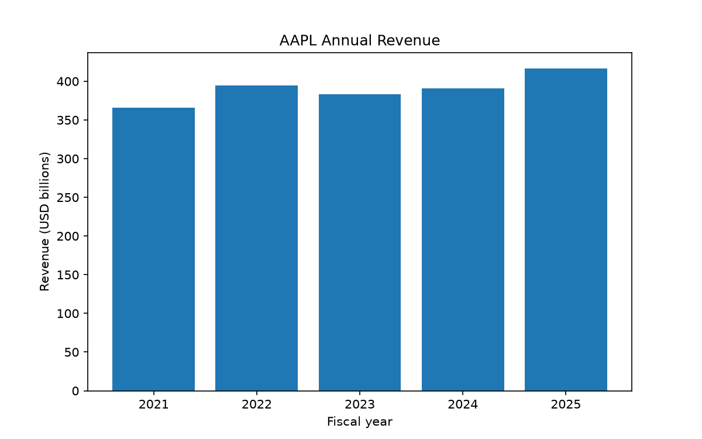
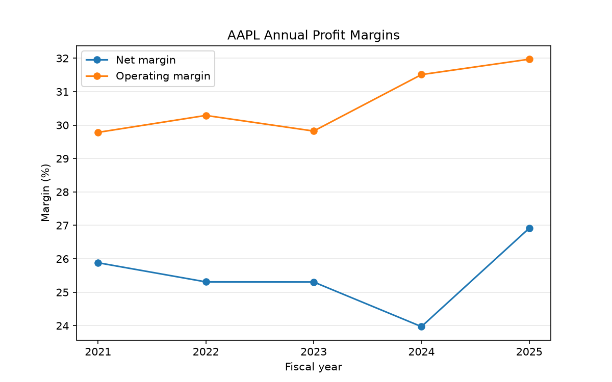

# Filing Alpha - V 1.0

- A Python tool that turns SEC financial data into annual summaries and charts.

- Enter a company ticker once to download its financial data, calculate revenue growth and profit margins, and save the results in a company-specific folder.

## Example

## Features

- Downloads financial facts from the SEC Company Facts API.

- Extracts annual revenue, operating income, and net income.

- Selects the most recently filed observation for each financial period.

- Calculates operating margin, net margin, and year-over-year revenue growth.

- Exports a CSV containing financial values, calculated metrics, and source accession numbers.

- Generates revenue and profit-margin charts.

# Verified Companies
The following companies produced five complete annual periods. Their saved financial values were checked against original SEC filings on October 2 2026.

- Apple : AAPL
- Microsoft : MSFT
- Amazon : AMZN
- Meta : META
- Salesforce : CRM
- Intel : INTC
- AMD : AMD
- Cisco : CSCO
- Oracle : ORCL
- Costco : COST

## Setup 
These instructions use windows powershell and python 3.11

    python -m venv .venv
    .\.venv\Scripts\Activate.ps1

    python -m pip install -r requirements.txt

    Copy-Item .env.example .env

- Before downloading SEC data, update the SEC_CONTACT_EMAIL value in the .env with your email.
- The download script includes this email in its SEC request header.

## Start
    
    python src/main.py

The program will:

1. Download the company’s SEC financial data.

2. Build its annual summary.

3. Save the CSV and both charts.

4. Display the charts.

## Additional Script

- src/market_data.py isnt ran under main.py, it downloads historical stock prices using yfinance. It is separate from the current capability of the financial analysis and is not required to generate the summary or charts.

## Generated Files

- Downloaded data and generated results are excluded from Git. The images in docs/images are saved examples; running the scripts does not update those copies.

- The CSV contains reporting dates, financial values in USD, margins, revenue growth, and source accession numbers. Percentage values use percentage units: 6.43 means 6.43%.

## Scope and limitations

- I originally built this version around Apple’s financial data since building a general tool with the goal of handling most companies exceeded my scope. Other companies may use different financial tags, so changing the ticker alone might not work, however I tested it with various other and came up with a list of 10 companies I verified the results for.

- The code looks for annual records covering 350–380 days. This works for the Apple data used here, but may need adjustments for other reporting periods.

- If matching revenue or income data is missing, that period is skipped, so the output may contain fewer than five years.

- For each metric, the code keeps the most recently filed value available in the downloaded data. It also saves the filing identifier so the source can be checked.

- Downloading newer filings may change the results if earlier figures have been updated.

- This project looks at historical financial performance. It does not predict stock prices or recreate exactly what information was available to investors at a past date.

## Running Individual Steps
Each script can also be run separately and will prompt for a ticker:

    python src/sec_data.py
    python src/process_data.py
    python src/plot_data.py

Processing requires the downloaded data from sec_data, and plotting requires the generated summary that process_data creates.

## Tools

- Python, Requests, python-dotenv, Matplotlib, and Python’s built-in JSON and CSV modules. The optional market_data script uses yfinance.